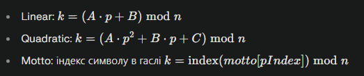
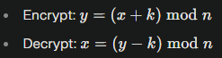

## Основні можливості
- Шифрування та дешифрування тексту за ключем зсуву у межах довжини обраного алфавіту.  
- Перемикання мов: українська (33 символи з урахуванням алфавіту інтерфейсу) та англійська (26 символів), динамічне оновлення діапазону ключа.  
- Brute force з перебором усіх ключів, прогрес‑баром і швидким вибором кращого результату.  
- Робота з файлами: створення нового, відкриття, збереження, друк, відображення імені файла.  
- Налаштування обробки регістру та неалфавітних символів, клавіатурні скорочення.  

***

## Архітектура та файли
- **index.html**: розмітка застосунку (шапка, меню, тулбар, робоча область, модалі), підключення скрипту.  
- **app.js**: логіка застосунку — класи, обробники подій, криптографічні операції, brute force, робота з файлами, налаштування.  

***

## Інтерфейс користувача (UI)

### Заголовок і головне меню
- Дії над файлами: New, Open, Save, Print, Exit  
- Криптодії: Encrypt, Decrypt, Brute Force  
- Мова та налаштування  
- Довідка та розділ «Про програму»  

### Тулбар
- Кнопки Encrypt, Decrypt, Brute Force  
- Селектор мови з кількістю можливих ключів для алфавіту  

### Робоча область
- Вхідний текст (textarea), кнопка завантаження з файла, індикатор імені файла  
- Блок ключа: числове поле, діапазон, швидкі кнопки, валідація  
- Вихідний текст (textarea readonly), лічильник символів і час виконання  

### Модалі
- **Brute Force**: інструкція, прогрес‑бар, список результатів  
- **Settings**: регістр, обробка неалфавітних символів  
- **Help**: довідка з формулами та кроками користування  
- **About**: версія, рік, автор, список функцій  

***

## Дані та конфігурація
- Набори символів: верхній і нижній регістри для кожної мови.  
- Зразки текстів і довідкова інформація про шифр Цезаря.  
- Параметри налаштувань:  
  - `caseHandling: preserve | upper | lower`  
  - `nonAlphaHandling: preserve | remove | space`  
- Поточна мова визначає довжину алфавіту, діапазон ключа та валідацію.  

***

## Класи та API

### KeyValidator
- **Призначення**: перевірка введеного ключа.  
- Методи:  
  - `validate(key)` → `{ valid, message }`  
  - `getRange()` → "1-maxKey"  
- Поля: `language, maxKey`  

### CaesarCipher
- **Призначення**: шифрування/дешифрування з урахуванням мови, регістру, політики неалфавітних символів.  
- Методи:  
  - `encrypt(text, key)`  
  - `decrypt(text, key)`  
  - `processText(text, key, isEncrypt)`  
    - Формули:  
      - Encrypt: $$ y = (x + k) \mod n $$  
      - Decrypt: $$ x = (y - k) \mod n $$  
- Поля: `language, data, validator`  

### BruteForceAttacker
- **Призначення**: підбір ключа повним перебором.  
- Методи:  
  - `attack(ciphertext, callback)`  
  - `scoreText(text)`  
- Поля: `language, cipher, alphabetSize`  

### FileHandler
- **Призначення**: робота з файлами у браузері.  
- Методи:  
  - `loadFile(file): Promise<string>`  
  - `saveFile(content, filename)`  

### TrithemiusKey
- **Призначення**: формує послідовність ключових зсувів для шифру Трітеміуса залежно від режиму (лінійний, квадратичний або гасловий).

- Поля:

  - `mode — режим ключа (linear, quadratic, motto)`

  - `params — параметри ключа (A, B, C, pBase або motto, pBase)`

- Методи:

  - `kAt(pIndex, n, alphabet) — обчислює числове значення ключа для позиції pIndex`

Формули:
  

### TrithemiusKeyValidator
- **Призначення**: перевіряє коректність параметрів ключа для вибраного режиму.

- Методи:

  - `validate(mode, params, alphabet)`

    - Перевіряє:

      - `Числові параметри для linear і quadratic`

      - `Наявність гасла і його символів в алфавіті для motto`
    - Повертає об’єкт {valid, message}

  
### TrithemiusCipher

- **Призначення**: виконує шифрування та дешифрування текстів методом Трітеміуса з урахуванням регістру і політики для неалфавітних символів.

- Поля:

  - `alphabet, lower, n – алфавіт, його нижній варіант, довжина`

- Методи:

  - `indexOfChar(ch) — знаходить індекс символу в алфавіті`

  - `mapIdx(idx, isUpper) — повертає символ за індексом`

  - `transform(text, key, mode) — загальний метод шифрування/дешифрування`

  - Формули:

    

  - `encrypt(text, key)`

  - `decrypt(text, key)`

### BookCipherKey

- **Призначення**: створює ключову матрицю з тексту (наприклад, вірша) для координатного шифру «книга».

- Поля:

  * `gridSize — розмір матриці (напр. 10×10)`
  * `grid — матриця символів`
  * `coordinateMap — відповідність символів координатам`

- Методи:

  * `buildGrid(text, size) — очищає текст і формує матрицю`
  * `buildCoordinateMap() — створює відповідність символ → координата`
  * `getCoordinate(char) — знаходить координати символу`
  * `charAtCoordinate(row, col) — повертає символ за координатами`

### BookCipher
- **Призначення**: реалізує класичний шифр «книга» (Book / Poem Cipher), використовуючи координати символів у сітці.

- Поля:

  * `language — мова шифру`
  * `key — об’єкт BookCipherKey`

- Методи:

  * `setKey(bookCipherKey) — встановлює ключ`
  * `encrypt(text, key) — кодує текст у координати`
  * `decrypt(coordString, key) — декодує координати назад у текст`

***

## Глобальні екземпляри
- `cipher: CaesarCipher`  
- `validator: KeyValidator`  
- `bruteForcer: BruteForceAttacker`  

***

## Обробники подій та дії UI

### Ініціалізація
- Завантаження DOM → оновлення мови, діапазон ключа, підписка на події.  

### Файлові операції
- **newFile**: очищення робочої області  
- **openFile**: завантаження тексту з `.txt`  
- **saveFile**: збереження з timestamp  
- **printFile**: друк відформатованого вмісту  
- **exitApp**: спроба закрити вкладку  

### Криптооперації
- `encrypt()/decrypt()` → делегують у `performCryptOperation`  
- `performCryptOperation(isEncrypt)`: бере вхідні дані, валідує, виконує операцію, міряє час, оновлює лічильник  

### Мова
- `changeLanguage()` — перемикає мову та оновлює UI  
- `toggleLanguage()` — швидке перемикання  
- `updateLanguage()` — перевизначає cipher/validator/bruteForcer  

### Ключ
- `validateKey()` — перевірка й повідомлення  
- `generateRandomKey()`  
- `setKey(k)`  

### Допоміжні
- `loadSample()`  
- `copyResult()`  
- `clearResult()`  
- `updateCharCount()`  

### Brute Force
- `showBruteForce()`  
- `startBruteForce()`  
- `selectBruteForceResult(key, text)`  
- `closeBruteForce()`  

### Settings
- `showSettings()/closeSettings()`  
- `saveSettings()`  

### Help / About
- `showHelp()/closeHelp()`  
- `showAbout()/closeAbout()`  

***

## Клавіатурні скорочення
- Ctrl+E — Encrypt  
- Ctrl+D — Decrypt  
- Ctrl+S — Save  
- Ctrl+O — Open  
- Ctrl+N — New  

***

## Алгоритмічні деталі

### Алфавіти
- Два масиви символів (верхній/нижній регістри).  

### Обробка регістру
- preserve, upper, lower  

### Неалфавітні символи
- preserve, remove, space  

### Перевірка ключа
- `1 ≤ key ≤ |α|−1`  

***

## Потоки сценаріїв використання

### Шифрування
1. Вставити текст  
2. Обрати мову  
3. Ввести ключ або Random  
4. Натиснути Encrypt (Ctrl+E)  
5. Переглянути, зберегти або скопіювати результат  

### Дешифрування
1. Вставити шифротекст  
2. Обрати мову  
3. Ввести ключ  
4. Натиснути Decrypt (Ctrl+D)  
5. Переглянути результат  

### Brute force
1. Вставити шифротекст  
2. Вибрати мову  
3. Запустити перебір  
4. Переглянути результати, вибрати найкращий  

***

## Повідомлення про помилки та UX
- Порожній Input → попередження  
- Невалідний ключ → повідомлення з підсвічуванням  
- Brute force: повідомлення у консолі при винятках

***

## Безпека та обмеження
- Шифр Цезаря — лише для навчальних цілей, не забезпечує реального захисту.  
- Уся робота відбувається у браузері, локально.  

***

## Формули (Help)
- Шифрування:  y = (x + k) \ mod n   
- Дешифрування:  x = (y - k) \ mod n  
- де x, y — індекси символів, n — розмір алфавіту, k — ключ  

